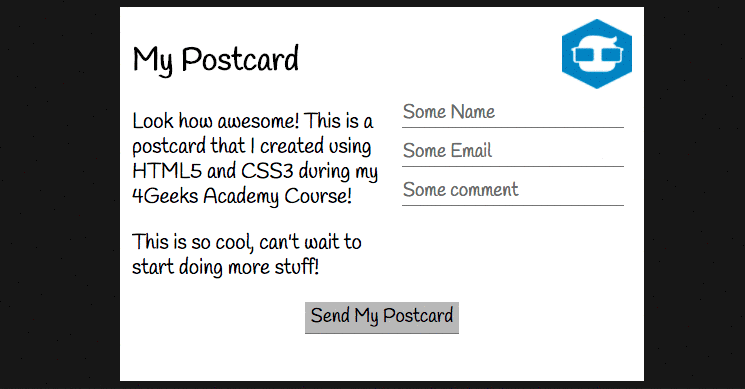

# `13` Check Your Postcard

La última parte será el pie del postcard. ¿Cuál es el único elemento presente allí?



## 📝 Instrucciones:

1. Crea un botón `<button>` en tu archivo `index.html` y agrégalo al div con la clase: `.postcard-footer`.

```html
<div class="postcard-footer">
	<button>Send My Postcard</button>
</div>
``` 

2. Aplica la regla `text-align: center;` a la clase `.postcard-footer`, este estilo ayudará a alinear el contenido del `<div>` hacia el centro (el botón estará centrado).

```css
.postcard-footer {
	text-align: x;
}
``` 

3. Aplica un `background` más oscuro y un `padding` al botón.

```css
button {
	background-color: x;
	padding: x;
}
```
